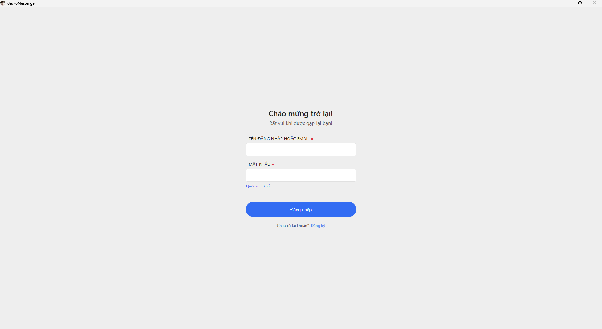
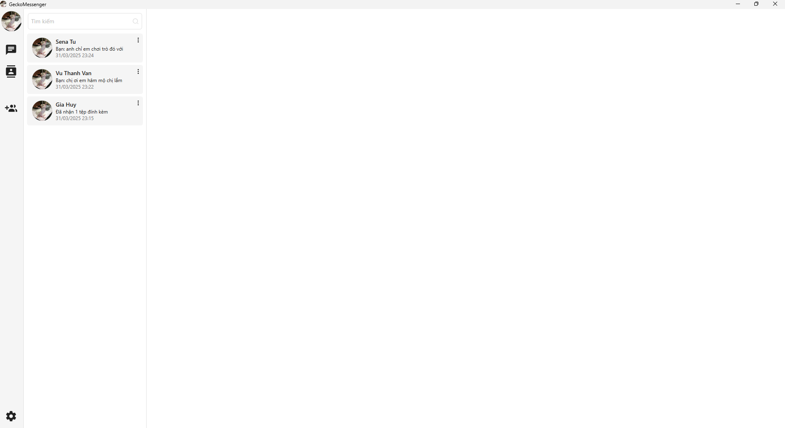
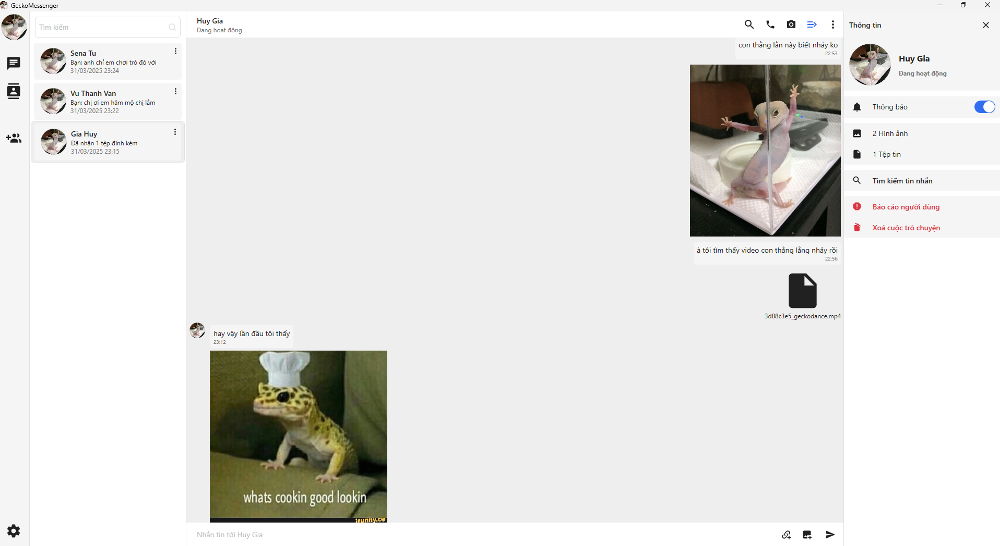
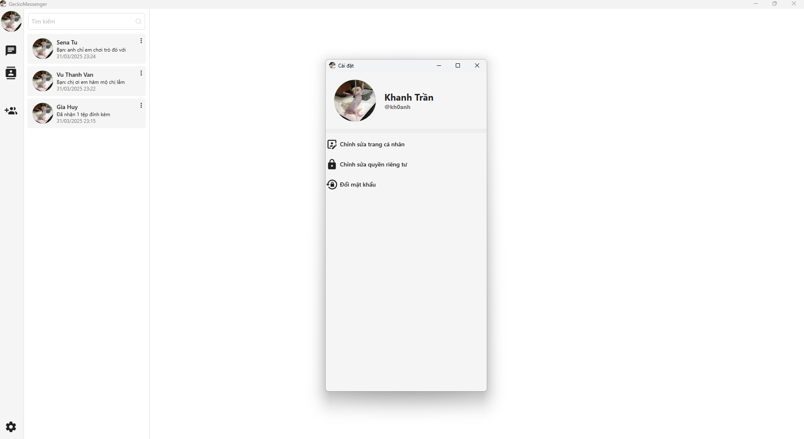

<div align="center">
  
  
  # GeckoMessenger
  
  **Nền tảng Nhắn tin trên Desktop An toàn, Nhanh chóng và Thông minh**
  
  [](https://docs.microsoft.com/en-us/dotnet/desktop/wpf/)
  [](https://docs.microsoft.com/en-us/dotnet/csharp/)
  [](https://www.microsoft.com/en-us/sql-server)
  [](https://jwt.io/)
  
  *Đồ án Cơ sở Ngành Kỹ thuật Phần mềm tập trung vào bảo mật đầu cuối (E2EE), giao tiếp thời gian thực trơn tru và kiến trúc phần mềm mạnh mẽ (MVVM).*
</div>

---

## 📖 Tổng quan

**GeckoMessenger** là một ứng dụng nhắn tin trên desktop theo định hướng bảo mật, cung cấp nền tảng giao tiếp trực tuyến an toàn và mượt mà. Được xây dựng dựa trên kiến trúc Client-Server mạnh mẽ với **WPF (C#)** cho giao diện client phong phú, **ServiceStack REST API** và **SQL Server**, nền tảng tập trung vào khả năng bảo trì, hiệu năng và bảo mật cấp cao.

### 📌 Thông tin dự án

- **Loại đề tài:** Đồ án Cơ sở 01 (Ngành Kỹ thuật Phần mềm)
- **Trường:** Trường Đại học Nam Cần Thơ
- **Sinh viên thực hiện** Trần Nguyễn Chí Khanh ([@kh0anh](https://github.com/kh0anh)) & Võ Nguyễn Gia Huy ([@studywithhuyne](https://github.com/studywithhuyne))
- **Năm thực hiện:** 2025

---

## ✨ Tính năng nổi bật

- **Mã hóa đầu cuối (E2EE):** Bảo mật nội dung trao đổi thông qua cơ chế mã hóa kết hợp RSA/AES.
- **Xác thực an toàn:** Quản lý phiên bằng JWT và băm mật khẩu chuẩn BCrypt.
- **Đa dạng giao tiếp:** Hỗ trợ nhắn tin cá nhân, nhắn tin nhóm, chia sẻ đa phương tiện (ảnh, video, văn bản).
- **Trợ lý AI:** Tích hợp AI trò chuyện trực tiếp trên ứng dụng hỗ trợ người dùng.
- **Quản trị & Quyền riêng tư:** Kiểm duyệt nội dung, báo cáo vi phạm, cấm tài khoản, tùy chọn thu hồi/xóa tin nhắn và thiết lập quyền riêng tư.
- **Quản lý danh bạ thông minh:** Thêm bạn, chặn tài khoản và hệ thống gợi ý kết bạn.
- **Tìm kiếm nhạy bén:** Tìm kiếm văn bản nhanh trong tin nhắn, nhóm, và người dùng.

---

## 🏗️ Kiến trúc hệ thống

GeckoMessenger tuân thủ mô hình **Client-Server 3 lớp (3-Tier)** cùng với **MVVM**:

1. **Client Desktop (WPF, MVVM):** Giao diện người dùng hiện đại, phát triển với `HandyControls` và `Material Icons`.
2. **API Server (ServiceStack):** Đóng vai trò xử lý nghiệp vụ trung tâm, điều phối RESTful API, xác thực JWT.
3. **Database (SQL Server):** Quản trị dữ liệu quan hệ kết hợp ORM `ServiceStack.OrmLite` tương tác siêu tốc.

---

## 🚀 Hướng dẫn deploy

### 1. Yêu cầu môi trường

- **Hệ điều hành:** Windows 10/11
- **IDE:** Visual Studio 2022 (cần có workload "Desktop Development with .NET")
- **Framework:** .NET Framework 4.8
- **Cơ sở dữ liệu:** Microsoft SQL Server

### 2. Thiết lập Cơ sở dữ liệu

1. Tạo một database mới trên SQL Server.
2. Chạy file script SQL tại `docs/database/database.sql`.
3. Cập nhật chuỗi kết nối (Connection String) trong file `src/APIServer/Program.cs`.

### 3. Build & Khởi chạy

1. Mở file solution `src/GeckoMessenger.sln` bằng Visual Studio.
2. Khôi phục toàn bộ (Restore) NuGet packages.
3. Chạy project **APIServer** để bắt đầu server (Mặc định ở `http://localhost:8080/`).
4. Khởi chạy project **Messenger** (Client). *(Lưu ý: Bạn có thể đổi host/port trong `src/Messenger/App.config`).*

---

## 📸 Giao diện ứng dụng (Screenshots)

<div align="center">

| Đăng nhập (Login) | Màn hình chính (Home) |
| :---: | :---: |
|  |  |

| Nhắn tin (Chat) | Cài đặt (Settings) |
| :---: | :---: |
|  |  |

</div>

---

## 📁 Tổ chức mã nguồn (Cấu trúc thư mục)

```text
📁 GeckoMessenger
├── 📁 src
│   ├── 📁 APIServer         # Backend ServiceStack API
│   ├── 📁 Messenger         # Desktop WPF Client (.NET 4.8)
│   └── 📁 packages          # Thư mục NuGet (packages.config)
└── 📁 docs
    ├── 📁 architecture      # Tài liệu kiến trúc
    ├── 📁 database          # Kịch bản CSDL & Đặc tả
    ├── 📁 diagram           # Sơ đồ UML/DFD/ERD
    ├── 📁 report            # File báo cáo đồ án (*.docx)
    └── 📁 screenshot        # Hình ảnh minh họa UI
```